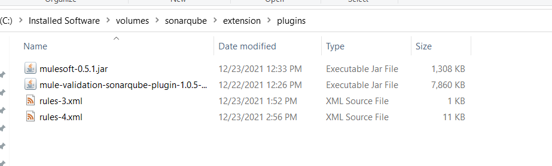
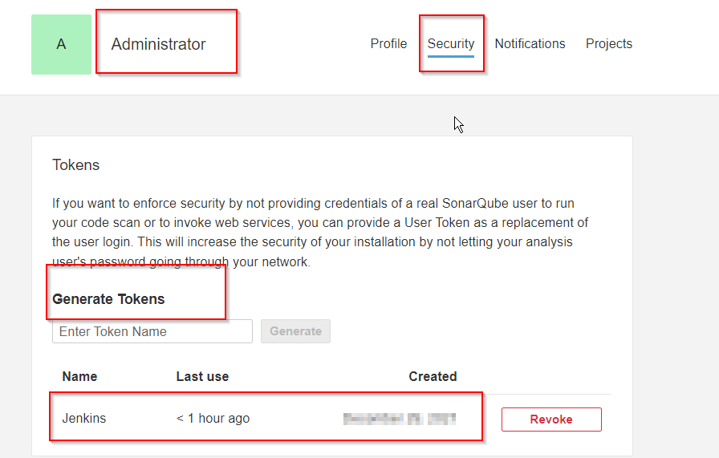
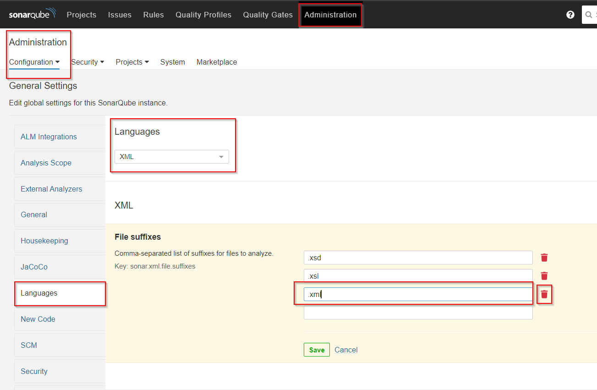
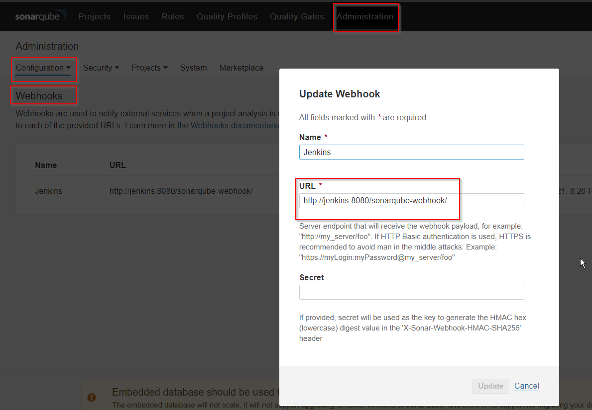
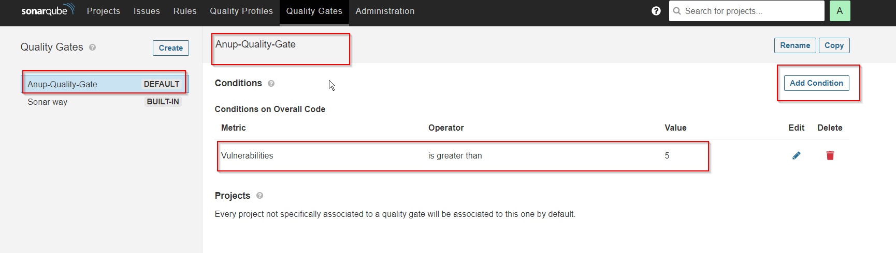
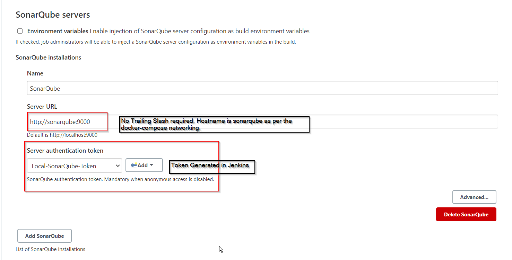
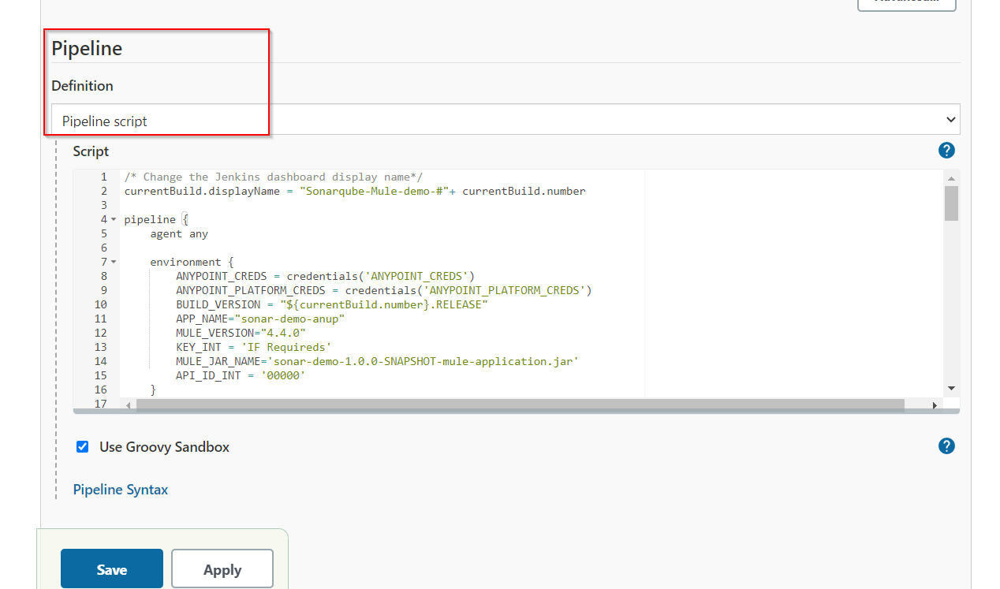
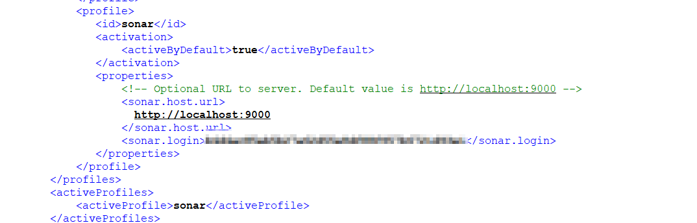

# mule-jenkins-sonarqube
Check the Mule code quality based on the ruleset defined using mule-sonar-plugin
Mule Project quality check using Sonarqube and further deploy the to cloudhub using Jenkins pipeline.

########################################################################################################################################
## prerequisite:
1. Docker
2. Docker-compose
3. Postman
4. MuleSoft Anypoint Studio

########################################################################################################################################
## Specifics 
| Files | Description |
| ------ | ------ |
| jenkins\Dockerfile | To build Jenkins Server.|
| sonarqube\extension\plugins\mule-validation-sonarqube-plugin-1.0.5-mule.jar | Plugin Generated from Mule sonarqube plugin repo. To install a plugin copy it to $SONARQUBE-HOME/extensions/plugins (Docker Volume Mount)|
| sonarqube\extension\plugins\rules-4.xml | Quality Rules set file for Mule 4. To install a plugin copy it to $SONARQUBE-HOME/extensions/plugins (Docker Volume Mount)|
| sonarqube\extension\plugins\rules-3.xml | Quality Rules set file for Mule 3. To install a plugin copy it to $SONARQUBE-HOME/extensions/plugins (Docker Volume Mount)|
| sonarqube\extension\plugins\mulesoft-0.5.1.jar | A SonarQube Plugin for MuleSoft workflow projects. The plugin scans MuleSoft reports and provides coverage validation. To install a plugin copy it to $SONARQUBE-HOME/extensions/plugins (Docker Volume Mount)|

########################################################################################################################################
## SonarQube

### Plugin Generation
1. Download the module source code from "https://github.com/mulesoft-catalyst/mule-sonarqube-plugin"
2. Open a terminal window and browse to module root folder.
3. Build the mule plugin for Mule rules running 
    mvn clean package sonar-packaging:sonar-plugin -Dlanguage=mule

### Plugin Installation
1. Copy the generated file from the  
    mule-validation-sonarqube-plugin-{version}-mule.jar to sonar-home/extensions/plugins
2. Copy rules Mule 3 Rules or Mule 4 Rules to sonar-home/extensions/plugins The jar file of the plugin has to be placed in the following folder 
    /extensions/plugins/ (Rules can be updated as per requirement)  
    

### SonarQube Configuration
1. Generate the access token using which Jenkins server can reach SonarQube;
    
2. Remove the default sonarqube .xml scanner to avoid mule and xml language both scanning the same file with different rules. 
    
3. Add the webhook for Jenkins server so that sonarqube server can call after finishing the quality check
    
4. Defind Quality Gate to check and Pass or Fail the code quality. 
    

########################################################################################################################################
## Jenkins
1. Add Managed File Plugins, Credentials Plugin
2. Install Maven in Jenkins server.
3. Add the required credentials 
4. Add SonarQube server in Managed Jenkins > Configure system
     
5. create a required job with your repository
    

########################################################################################################################################
## Mule Application
1. To test the code quality from local setup
    mvn sonar:sonar -Dsonar.host.url=http://hostname:port -Dsonar.sources=src/
2. Add Appropriate entry in settings.xml
    

########################################################################################################################################
## Verification
1. Install the Jenkins & SonarQube server stack. 
```sh
    docker-compose up
```
2. Run the Jenkins job which pulls the code from Github server. 
3. Check the job status; if success, then code will be deployed to MuleSoft Cloudhub. 

########################################################################################################################################
## References:
1. Mule sonarqube plugin
    https://github.com/mulesoft-catalyst/mule-sonarqube-plugin
2. Mule Coverage report Plugin
    https://docs.mulesoft.com/munit/2.3/coverage-maven-concept
    https://www.sonarplugins.com/mulesoft 
    https://github.com/UltimateSoftware/sonar-mulesoft
    https://mvnrepository.com/artifact/com.ultimatesoftware.sonar.plugins.mulesoft/mulesoftplugin
3.  http://xmltoolbox.appspot.com/xpath_generator.html
    https://www.freeformatter.com/xpath-tester.html#ad-output
    https://developer.mozilla.org/en-US/docs/Web/XPath/Functions

########################################################################################################################################